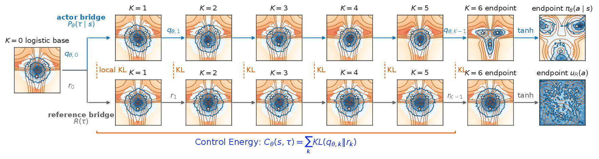
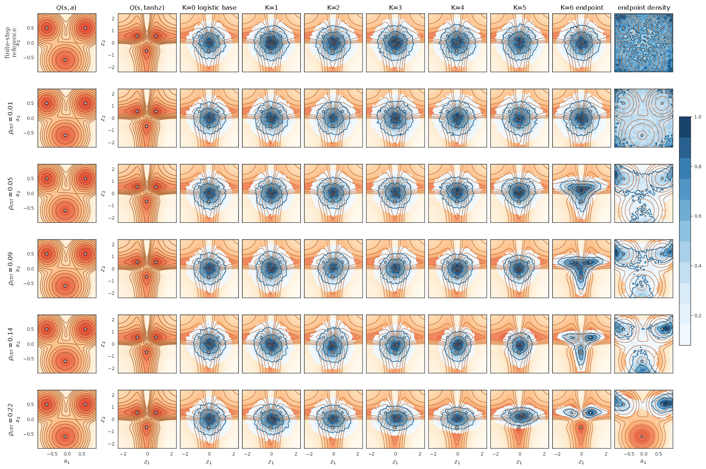

# SoftGAC

**Generative Actor-Critic with Soft Bridge Policies**

*Maximum-entropy reinforcement learning with lightweight stochastic bridge actors*

[Preprint PDF](preprint.pdf) | [Code](https://github.com/skypitcher/soft_gac_jax)

SoftGAC is a JAX implementation of an off-policy maximum-entropy RL method for expressive continuous-control policies. The actor is a lightweight stochastic bridge in pre-tanh latent space. Instead of estimating endpoint policy entropy, SoftGAC regularizes the full generation path by an analytical path-wise relative entropy to a high-entropy reference process, which becomes sampled transition control energy in the finite-step implementation.

## Concept

<p align="center">
  
</p>

SoftGAC compares a learned stochastic bridge with a high-entropy reference bridge through local KL terms. Their sum gives a sampled control-energy regularizer, while the terminal latent is mapped through `tanh` and evaluated by the critic.

<details>
<summary>2D bridge visualization with different control-energy budget</summary>

<p align="center">
  
</p>

The toy visualization shows how the bridge transports a base latent distribution toward value-guided endpoint distributions under different control-energy budgets.

</details>

## Quick Start

The default setup targets TPU JAX and CPU-only PyTorch. PyTorch is used only for Stable-Baselines3 replay-buffer tensors.

```bash
git clone https://github.com/skypitcher/soft_gac_jax.git
cd soft_gac_jax
./setup.sh
conda activate soft_gac
python main.py
```

The default command runs SoftGAC on `dm_control/dog-run`. To verify the accelerator backend:

```bash
python - <<'PY'
import jax
print(jax.__version__)
print(jax.default_backend())
print(jax.devices())
PY
```

## Installation

For CUDA 12 GPUs, install the GPU requirements explicitly:

```bash
REQ_FILE=requirements-gpu.txt ./setup.sh
conda activate soft_gac
```

For HumanoidBench tasks such as `h1-hurdle-v0`, use the dedicated environment:

```bash
./setup_humanoidbench.sh
conda activate soft_gac_humanoidbench
```

## Usage

SoftGAC examples:

```bash
python main.py alg=soft_gac env_name=dm_control/dog-run \
  alg.actor.hidden_size=256 alg.actor.num_layers=6

python main.py alg=soft_gac env_name=dm_control/humanoid-run \
  alg.actor.hidden_size=512 alg.actor.num_layers=6 \
  alg.train.num_particles=16

python main.py alg=soft_gac env_name=dm_control/humanoid-run \
  alg.actor.hidden_size=512 alg.actor.num_layers=6 \
  alg.train.num_particles=4 alg.train.particle_scheme=antithetic

python main.py alg=soft_gac env_name=h1-hurdle-v0 \
  alg.actor.hidden_size=512 alg.actor.num_layers=6
```


Available algorithms are `soft_gac`, `sac`, `dime`, `flowrl`, `flac`, `qsm` and `qvpo`.

## Multi-Seed Runs

Run the default 8 seeds:

```bash
bash run_seeds_new.sh alg=soft_gac env_name=dm_control/dog-run
```

Do not pass `seed=...` manually. The launcher assigns one seed per subprocess.

## Configuration

Use `key=value` overrides from the command line. Global defaults are in `configs/main.yaml`, and per-algorithm defaults are in `configs/alg/*.yaml`.

```bash
python main.py tot_time_steps=100000 eval_freq=5000 wandb.enabled=false
python main.py alg.replay.mix_recent=false
python main.py alg.train.particle_scheme=antithetic
python main.py checkpoint.enabled=false
python main.py use_jit=false
```

Most tasks use 1M environment steps by default. Harder tasks such as `dm_control/humanoid-run` and `h1-hurdle-v0` use 3M unless explicitly overridden.

## Note on Occasional Dead Seeds

In rare cases, sensitivity to the combination of a high-dimensional, contact-rich locomotion task, hardware platform and random seed can produce one or two dead seeds, even though the remaining seeds learn normally. In our runs, this was observed for `dm_control/humanoid-run` seeds 6 and 7 on TPU with `alg.train.num_particles=1`. The other 11 benchmark tasks did not show this issue across 8 seeds with `num_particles=1`.

If this occurs, the practical fix is to reduce actor-update variance by increasing the number of bridge particles, for example from `np=1` to `np=32`, or by using a smaller antithetic setting such as `np4ant`, which uses 8 paired samples:

```bash
python main.py alg=soft_gac env_name=dm_control/humanoid-run \
  alg.actor.hidden_size=512 alg.actor.num_layers=6 \
  alg.train.num_particles=32

python main.py alg=soft_gac env_name=dm_control/humanoid-run \
  alg.actor.hidden_size=512 alg.actor.num_layers=6 \
  alg.train.num_particles=4 alg.train.particle_scheme=antithetic
```

These options only affect training-time actor updates. They do not change inference-time action generation. The run label records the particle setting, for example `np32` or `np4ant`.

## Outputs

Runs are saved under:

```text
results/<env-dir>/<run-label>/<timestamp>_seedN/
```

Each run writes `config.log`, `training.log`, `train.csv`, `eval.csv` and `code_snapshot.zip`. SoftGAC saves a final checkpoint when `checkpoint.enabled=true`. W&B is disabled by default and can be enabled with `wandb.enabled=true`.

Generated directories such as `results/`, `logs/`, `wandb/`, `checkpoint/` and `__pycache__/` are ignored by `.gitignore`.

## Citation

```bibtex
@article{he2026softgac,
  title   = {Generative Actor-Critic with Soft Bridge Policies},
  author  = {He, Ke and He, Le and Tang, Shunpu and Wang, Yafei and Fan, Lisheng},
  journal = {arXiv preprint},
  year    = {2026}
}
```

## Acknowledgement

This work used compute resources from the Google TPU Research Cloud program.
